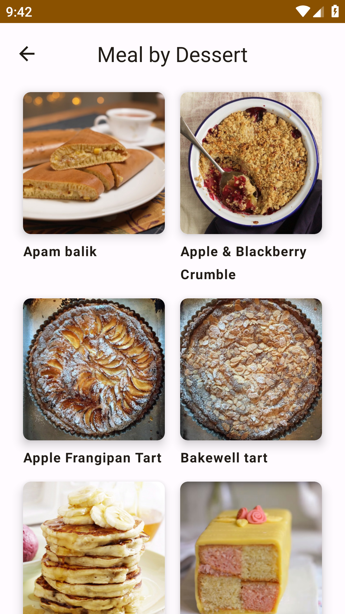

    <h1>Meal Recipe</h1>
    
An Android app for showing recipes some meal

---

  
  
  
  
  
  
  
  

## Features
- Search meal by Area, Category, and Name
- Save Recipe
- Detail Meal

## Tech Stack & Library
- [Gradle Version Catalog](gradle/libs.versions.toml)
- [Hilt](https://dagger.dev/hilt/) for Dependency Injection
- [Landscapist](https://github.com/skydoves/landscapist) for Image Loader
- [Ktorfit](https://github.com/Foso/Ktorfit) for HTTP Client
- [Room](https://developer.android.com/training/data-storage/room?hl=id) for Local DB
- [Compose Destinations](https://github.com/raamcosta/compose-destinations) for Compose Navigation
- [KSP](https://github.com/google/ksp) for Kotlin Symbol Processing API
- [Timber](https://github.com/JakeWharton/timber) for A logger
- [Youtube Player](https://github.com/PierfrancescoSoffritti/android-youtube-player) for Youtube Player
- Used AndroidX, Jetpack Compose, Material Design Components 3, ViewModel, and any more libraries

## Data Source
Meal Recipe using the [TheMealDB](https://www.themealdb.com/api.php) for constructing RESTful API. 
TheMealDB provides a RESTful API interface to highly detailed objects built from lines of data related to meals.