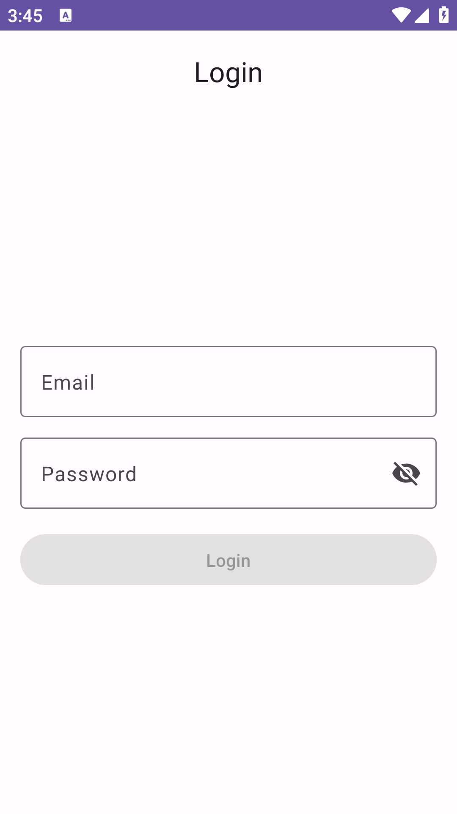

    <h1>Auth Test</h1>
    
An Android app for showing users with simple login

---

  
  
  

## Features
- Login
- User list

## Tech Stack & Library
- [Gradle Version Catalog](gradle/libs.versions.toml)
- [Hilt](https://dagger.dev/hilt/) for Dependency Injection
- [Landscapist](https://github.com/skydoves/landscapist) for Image Loader
- [Ktorfit](https://github.com/Foso/Ktorfit) for HTTP Client
- [DataStore](https://developer.android.com/topic/libraries/architecture/datastore) for New version of [SharedPreferences](https://developer.android.com/training/data-storage/shared-preferences)
- [Compose Destinations](https://github.com/raamcosta/compose-destinations) for Compose Navigation
- [KSP](https://github.com/google/ksp) for Kotlin Symbol Processing API
- [Paging 3](https://developer.android.com/topic/libraries/architecture/paging/v3-overview?hl=id) for Android Pagination
- [Timber](https://github.com/JakeWharton/timber) for A logger
- Used AndroidX, Jetpack Compose, Material Design Components 3, ViewModel, and any more libraries

## Data Source
Auth Test using the [ReqRes](https://reqres.in/) for constructing RESTful API. 
Auth Test provides a RESTful API interface to highly detailed objects built from lines of data related to user.